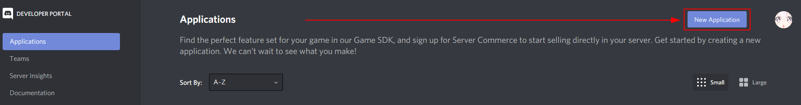
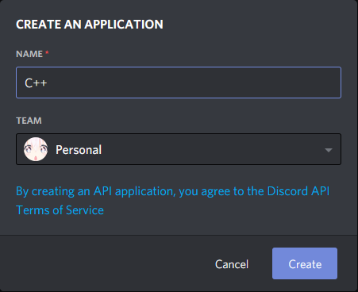
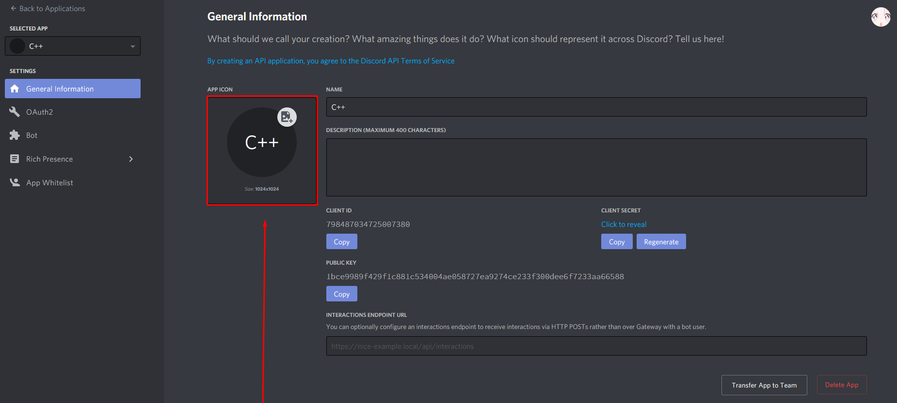
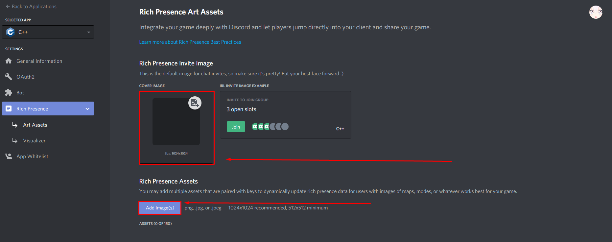
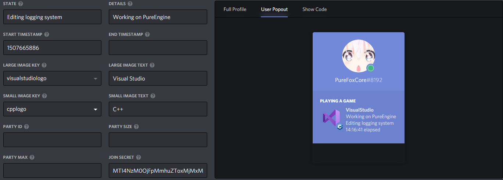
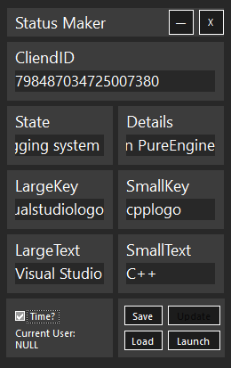

# StatusMaker
### Dependencies
 - [Discord RPC](https://github.com/Lachee/discord-rpc-csharp)
 - [Newtonsoft.Json](https://github.com/JamesNK/Newtonsoft.Json)
### How to use
 1. Open [Discord login page](https://discord.com/login) and login to your account
 2. Open [Discord Applications page](https://discord.com/developers/applications) and click **New Application**
 3. Give the **name** to your app and create
 4. Set icon *recomended size 1024x1024*
 5. Set App image and add new images *recomended size 1024x1024 and minimum size 512x512*
 6. Test all changes in Visualiser
 7. Write all changes to **StatusMaker**
 8. Save changes to json file or launch
 ----------
 
 
 
 
 
 